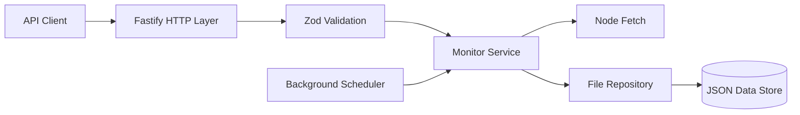
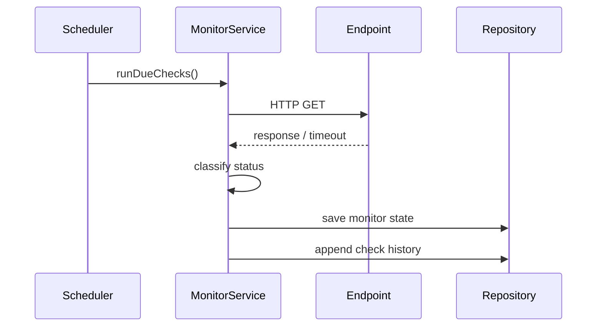

# PulseWatch Architecture

PulseWatch is intentionally small enough to understand quickly but structured like a production backend.

## System overview

## Responsibilities

### HTTP layer

The HTTP layer handles routing, request validation, HTTP status codes, rate limits, security headers, and consistent error responses.

### Domain layer

The domain layer owns monitor types and status classification. A monitor is classified as:

- **operational** when the expected status code is returned within the latency threshold;
- **degraded** when the endpoint responds correctly but is slower than the configured threshold;
- **down** when the request fails or returns an unexpected status;
- **unknown** before its first check.

### Service layer

`MonitorService` contains application behavior:

- create and update monitors;
- prevent duplicate URLs;
- run checks;
- avoid overlapping checks;
- calculate aggregate statistics;
- schedule the next check;
- store bounded check history.

### Infrastructure layer

`FileRepository` persists state to JSON using atomic temp-file replacement. Writes are serialized through an internal promise queue so concurrent checks do not write the file at the same time.

This repository abstraction can later be replaced by PostgreSQL, Redis, or another persistence layer without changing the HTTP contracts.

## Background scheduling

The scheduler runs at a configurable tick interval. Each monitor controls its own check interval, and active-check tracking prevents overlapping checks for the same endpoint.

## Engineering choices

- **Strict TypeScript** catches unsafe assumptions during development.
- **Zod** provides runtime validation because TypeScript types disappear at runtime.
- **Fastify** provides a lightweight typed HTTP server.
- **Rate limiting and security headers** protect public-facing endpoints.
- **Atomic writes and serialized persistence** protect the JSON store from common race conditions.
- **Vitest** covers domain behavior and API behavior.
- **Docker** provides a reproducible runtime.
- **GitHub Actions** validates type safety, tests, and compilation on every push.

## Natural next steps

For a production deployment, the strongest extensions would be PostgreSQL persistence, OpenTelemetry metrics/traces, alert delivery through email/Slack/webhooks, authentication, distributed scheduling, and a React or Next.js dashboard.
